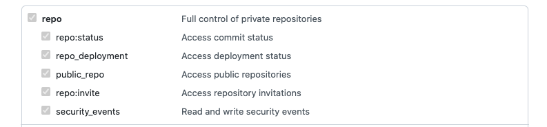
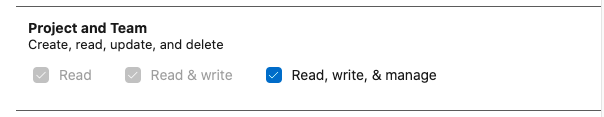

# staff-infrastructure-azure-landing-zone-spokes

This repository is used to capture the spokes in the azure landing zone

The objective is for each new spoke to create:

1. A new Project In Azure DevOps
2. A github repository for the spoke
3. A Service Connection for each environment with any relevant roles required as well as API permissions.

Note that the order above is important as it's not possible to create a service connection before the project exists and this leads directly to how the code is structured, see [Code Structure](#code-structure)
## Pre-Requisites

- Azure Subscriptions for all needed environments
- Azure Subscriptions must have been assigned to the correct Management Group, this will generally be spokes.


## Getting Started

You will need a github and azure devops token to develop or test your changes.  The tokens need to have the following permissions, see below

Create a file like [sample file](environments/../terraform/sample-alz-spokes.tfvars), ensure that you name it secrets.auto.tfvars (this will not be committed as it's in the gitignore)  and store your tokens there.

*Important*

This repository is public so if you commit the secrets file, make sure that you revoke your tokens as soon as possible

### Github

Full Control of private repositories



### Azure Devops

Read, Write and Manage for projects



 Read, Write and Manage for Service Connections

 

## Code Structure

Note that the names of the projects in both root modules need to match but the service connection root module does have check for existing projects, which will ensure that the pipeline will fail if names differ
### Projects And Repositories

The code that creates azure devops projects and the github repositories is in the [projects directory](terraform/projects)

The configuration of a new project is achieved using [projects.auto.tfvars](terraform/projects/projects.auto.tfvars)

Sample

```hcl
projects = {
  "staff-infrastructure-testspoke" = {
    project_description = "This is a test"
    repository_details = {
      description = "This is a test still"
      name        = "staff-infrastructure-testspoke"
      team_slug   = "cloud-ops-alz-admins"
    }
  }
}
```

### Service Connections

The code that creates the service connections in azure devops as well as the needed Service Principals is structured across many directories. The source code is in the [service-connection directory](terraform/service-connection), which is symlinked to each environment.

As the config will be different across environments, each service connection will need to be done across three files:

 - [dev.auto.tfvars](terraform/environments/dev/dev.auto.tfvars)
 - [preprod.auto.tfvars](terraform/environments/preprod/preprod.auto.tfvars)
 - [prod.auto.tfvars](terraform/environments/prod/prod.auto.tfvars)


```hcl
applications = {
  "staff-infrastructure-testspoke" = {
    app_display_name         = "MoJO-DEVL-TestSpoke-LandingZone"
    create_password          = true
    owners                   = []
    required_resource_access = []
    role_assignments = [
      {
        id        = "Testing_Contributor_n_Resource_Lock",
        role_name = "MoJO - LandingZone - Role - Contributor and resource lock",
        scope     = "/subscriptions/4b068872-d9f3-41bc-9c34-ffac17cf96d6",
      }
    ]
    service_endpoint_name = "scDevTest"
    subscription_id       = "4b068872-d9f3-41bc-9c34-ffac17cf96d6"
    subscription_name     = "MoJ-OFFICIAL-Devl-Spoke-Testing"
  }
}
```

## Pipeline

There is a [single pipeline](pipelines/deploy.yml), which has multiple stages to deploy the projects and github and then service connections for dev, preprod and prod.

The pipeline uses a template from the [staff-infrastructure-alz-templates](https://github.com/ministryofjustice/staff-infrastructure-alz-templates) repository.

Finally, note that the pipeline relies on a secret file called _alz-spokes.tfvars_ which should contain github and azure devops PATs, see [sample file](environments/../terraform/sample-alz-spokes.tfvars) for details


## Limitations

It's not possible to add via code the service connection to GitHub, this needs to be done manually.

### GitHub Service Connection

This might seem somewhat convoluted but I'm not 100% how to do it properly, namely adding a service connection seems to add service connection to my personal github account

 1. Once project has been created, navigate to Pipelines
 2. Click _Create Pipeline_
 3. Select Github
 4. Select the repository for this spoke
 5. Follow the menu to completion (I know, cracking instructions)


## Improvements

- Manage project memberships
- Script Github Service Connection, e.g. using Powershell
- Improve development workflow to avoid having to create a secrets file